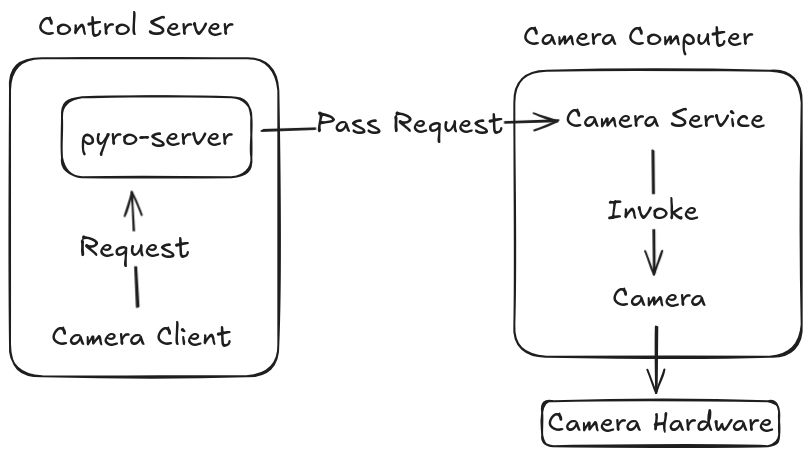

# Distributed System Architecture

This section provides a technical overview of the architecture of the Huntsman System.

## Distributed Systems

A distributed system is a coordinated collection of independent computers that work together to appear as a unified system.
Each machine contributes its own processing, storage, or communication capabilities, and the system relies on networked cooperation to achieve goals that would be difficult or inefficient for a single computer to handle.
The payoff is scalability and resilience, though it comes with challenges such as handling failures, ensuring consistency, and managing the unpredictability of networks.

## Huntsman Distribution

The huntsman setup uses between 3 and 12 machines:

- _Control Machine:_ The control computer acts as the central coordinating machine. It is where most of the user interaction will happen. It runs and exposes the various servers (e.g. config server, Pyro server) to the other machines.
- _Remote Machine:_ This is the final destination of the data.
- _Camera Machine (x10):_ There are up to 10 cameras running at a time. Each is attached to its own machine and has a unique IP.


## NFS Share

The Cameras need to be able to write their images to a common directory. For this purpose, a network file system (NFS) is set up on the control server.
Each of the cameras [mounts this directory](Setting-up-Huntsman-Control-Computer#setup-nfs-server) and writes their images to it.

## Pyro

In order to communicate with each of the cameras, Huntsman uses the Python Remote Objects library - [Pyro5](https://github.com/irmen/pyro5). Pyro is a tool that enables local objects to communicate with remote objects. The intent is to simplify the execution of remote code.

Huntsman uses Pyro as a means to operate each of its cameras from the (local) control server. How does it do this? Since we are employing Pyro, we have 3 camera objects rather than just 1:

- **Camera Client** - sends information/request to the **Camera Service**
- **Camera Service** - receives information/requests from the **Camera Client** and invokes appropriate actions on the **Camera** object
- **Camera** - the camera object on the camera machine that interacts with the hardware

The flow of information looks like this:


## Containers

Since this is a distributed service, use of containerisation technology is employed to ensure software portability between machines, network isolation and configuration. Use of a remote container registry also assists in synchronising code versioning with the use of image tags.

Huntsman uses [Docker](https://www.docker.com/) for containerisation and [Docker Hub](https://hub.docker.com/) for image versioning.

There are four main images that Huntsman builds:

- Panoptes Utils - Builds from Debian 12
- Panoptes POCS - Builds from Panoptes Utils. The base Panoptes image.
- Huntsman POCS - Builds from Panoptes POCS. Adds most Huntsman functionality and dependencies.
- Huntsman Camera - Builds from Huntsman POCS. Adds the camera libraries to the image.

The two Panoptes images are static and need not be iterated upon as they come from the original Panoptes fork. For the most part, users need only concern themselves with the two Huntsman images. Although first time builds will require the creation of the two base Panoptes images.

For guidance on how to use Docker and how it's intended to be used with the Huntsman environment, see [Using Docker](Using-Docker.md)

## SSH Access & Configuration

The Control Server uses SSH to communicate commands to both the Camera servers and the Remote server.
To streamline this interaction, the system relies on SSH key-based authentication and a shared SSH configuration (`~/.ssh/config`) on each host.

### Host Aliases

Each **machine** defines SSH aliases for the _hosts_ it needs to communicate with:

- **Control Server**
  - _Remote server_
  - _Cameras 1–10_
- **Camera Servers**
  - _Control server_
- **Remote Server**
  - _Control server_

These aliases allow components to reference each other by simple names rather than full IP addresses or user credentials.

An example SSH alias entry in a host’s `~/.ssh/config` file:

```bash
Host hostname1
    HostName xxx.xxx.xxx.xxx
    User Username
    IdentityFile ~/.ssh/hostname1_key
```

Where the IdentityFile is the SSH key used to access the host machine.

### Setting Up SSH Key Access

To enable seamless, password-less SSH communication between components, each host must set up key-based authentication to its peers:

1. **Generate an SSH key pair** on the machine that will initiate the connection:

```bash
ssh-keygen
```

You may wish to alter the name of the file so that it can be identified among the rest of your keys.

This command will create a **private** and **public** key. The private key will not have a file exension and should never be shared between machines. The public key will have the `.pub` exension and can be safely shared to other machines.

2. **Copy the public key to the remote host**:

```bash
ssh-copy-id -i ~/.ssh/my_key.pub username@remote_host_ip
```

If `ssh-copy-id` is not available, manually append the contents of `id_ed25519.pub` to the remote host’s `~/.ssh/authorized_keys` file.

3. **Test the connection**:

```bash
ssh username@remote_host_ip
```

A successful connection without a password prompt indicates that key-based authentication is correctly configured.

4. **Create the host alias** in `~/.ssh/config` to simplify future access:

```bash
Host my-remote
   HostName remote_host_ip
   User username
   IdentityFile ~/.ssh/my_key
```

Note the use of the private key for the `IdentityFile`

5. **Test the alias:**

```bash
ssh my-remote
```

This should successfully connect to the designated remote host.
