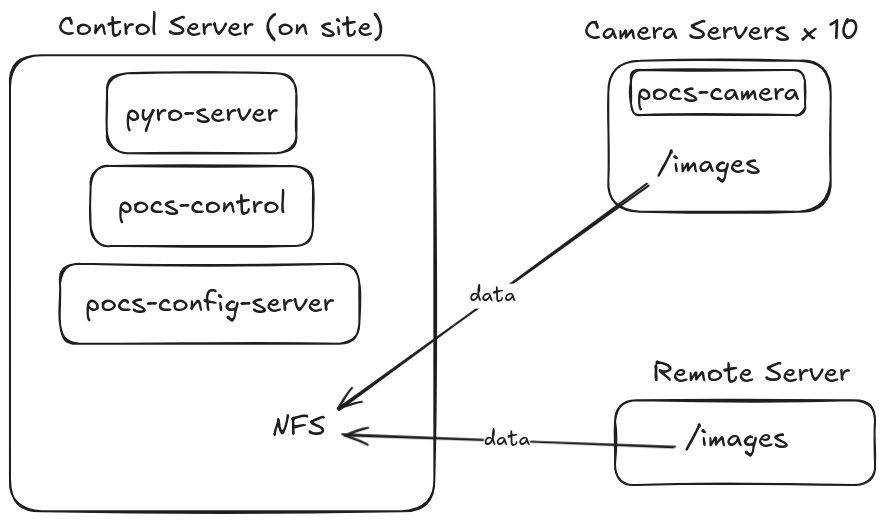

# Distributed System Architecture

This section provides a technical overview of the architecture of the Huntsman System.

## Distributed Systems

A distributed system is a coordinated collection of independent computers that work together to appear as a unified system.
Each machine contributes its own processing, storage, or communication capabilities, and the system relies on networked cooperation to achieve goals that would be difficult or inefficient for a single computer to handle.
The payoff is scalability and resilience, though it comes with challenges such as handling failures, ensuring consistency, and managing the unpredictability of networks.

## Huntsman Distribution

The huntsman setup uses between 3 and 12 machines:

- _Control Machine:_ The control computer acts as the central coordinating machine. It is where most of the user interaction will happen. It runs and exposes the various servers (e.g. config server, Pyro server) to the other machines.
- _Remote Machine:_ This is the final destination of the data.
- _Camera Machine (x10):_ There are up to 10 cameras running at a time. Each is attached to its own machine and has a unique IP.



## NFS Share

The Cameras need to be able to write their images to a common directory. For this purpose, a network file system (NFS) is set up on the control server.
Each of the cameras [mounts this directory](Setting-up-Huntsman-Control-Computer#setup-nfs-server) and writes their images to it.

## SSH Access & Configuration

The Control Server uses SSH to communicate commands to the Camera and Remote servers.
To streamline the use of SSH, the system makes use of the SSH Config.

The set up expects the following _host aliases_ for the following **hosts**:

- **Control**
  - _Remote server_
  - _Cameras 1 to 10_
- **Camera**
  - _Control server_
- **Remote**
  - _Control server_

Each SSH alias looks like this in the `~/.ssh/config` file of the host:

```bash
Host hostname1
    HostName xxx.xxx.xxx.xxx
    User Username
    IdentityFile ~/.ssh/hostname1_key
```

Note the use of an IdentityFile. We will similarly employ the use of SSH keys between each of the hosts. There are numerous guides available online detailing how to set up SSH keys between hosts so this will not be repeated here.

This setup has the advantage of seemless connectivity between each of our distributed components.
