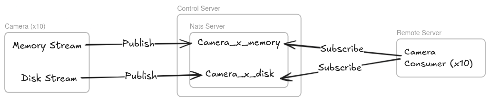
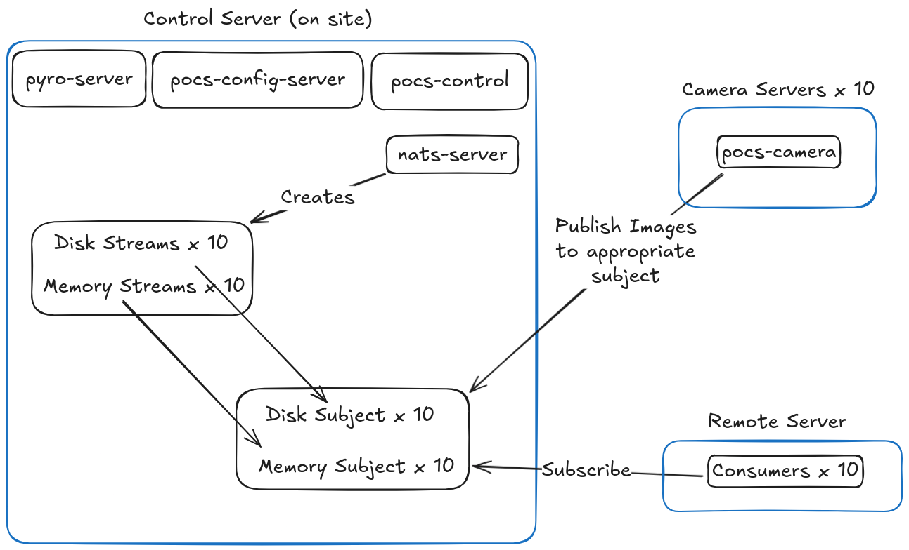

# Movie Mode

The Huntsman telescope has developed its own high-framerate capture mode, called _Movie Mode_. Because of its high throughput, Movie mode requires a different setup and approach to the traditional capture mode.

## The Details

The traditional capture mode writes each of the images to an NFS (network) share directory, which is then pickup up by the control server. This is infeasible for Movie mode as file throughput is too slow.

Instead, we use the high-performance publish/subscribe (pub/sub) system - [NATS Jetstream](https://docs.nats.io/nats-concepts/jetstream).

The movie mode setup includes the following components

- **Control**
  - **POCS Control System**: Core telescope control and configuration
  - **[NATS JetStream Server](https://docs.nats.io/nats-concepts/jetstream)**: High-performance message streaming for camera data using a [Pub/Sub model](##Pub-Sub).
    - **[JetStream Streams](https://docs.nats.io/nats-concepts/jetstream/streams):** The data streams that make publishes messages (images) to **subjects**. Makes the images available to **consumers**.
  - **Monitoring**: Real-time system memory usage tracking
  - **Storage Management**: Tiered storage system (memory → disk)
- **Cameras**
  - **[Pyro](https://github.com/irmen/pyro5)**: Python Remote Objects. Allows Python objects to communicate over networks
- **Remote**
  - **[Jetstream Consumers](https://docs.nats.io/nats-concepts/jetstream/consumers):** Subscribes to subjects. Used to recieve image data.

### Pub/Sub

Pub/Sub is a messaging system that treats the producer of information (publisher) as separate from the consumer (subscriber). Rather than sending a message directly to a consumer, the producer publishes it to some channel (i.e. _stream_). Any number of consumers can subscribe to this channel and recieve all data published to it.

In the case of Huntsman, each camera hosts two publishers which each write to their own channel (i.e. _subject_) and each of these publishers has a corresponding consumer on the remote server that subscribes to these two streams.



There are two streams per camera - a memory and a disk stream. By default, messages are published to the memory stream. This is imperative for throughput. However, should the memory usage surpass a predefined threshold, messages will be published to the disk until memory usage is back to acceptable levels.

## System Architecture

The Movie-Mode setup heaviliy utilises NATS JetStream messaging capabilities:



### Streams

For each active camera, two JetStream streams are created:

- Memory stream – used for in-memory streaming.
- Disk stream – used for on-disk streaming for when memory usage is too high.

A stream is a named, durable log that stores messages matching the subjects it is configured to receive, according to its retention and storage policies.

### Subjects

Each stream is associated with a single subject. Huntsman uses one subject per stream, resulting in one memory subject and one disk subject for each camera. Subjects do not require explicit creation; they become active when messages are published or when streams/consumers reference them.

### Monitor

A monitor process is started on the Control Server. It performs two functions:

- Memory usage reporting – The monitor periodically writes the server’s memory usage to a file, which the camera process reads before choosing where to publish images.
- Message migration – If memory usage exceeds a defined threshold, the monitor republishes all messages currently stored in memory streams to their corresponding disk subjects to prevent data loss.

### Image Publishing

When a camera captures a new image, it publishes the message to either the memory or disk subject, depending on the Control Server’s current memory usage.

### Consumers

On the Remote Server, each camera has one consumer that subscribes to both the memory and disk subjects for that camera. When a message is received, the consumer processes and acknowledges it, ensuring it is not redelivered. Messages remain in the underlying stream until removed by the stream’s retention policy.

## Setup

### SSH

See [SSH Configuration setup guide](Distributed-System-Architecture.md#ssh-access-&-configuration)


### Environment Variables

To run movie mode for the first time, you'll need to configure your environment variables. There is an [example .env file](https://github.com/AstroHuntsman/huntsman-pocs/blob/main/example.huntsman.env) for this purpose. Copy it with

```bash
cp example.huntsman.env huntsman.env
```

This file be sourced before running any scripts.

```bash
source huntsman.env
```

Most of the variables will not need changing, but it's good to give a quick once-over to make sure. See the following guide for variable descriptors:

**System Level Configuration**

| Variable                  | Description                                                                                                                                                                          |
| ------------------------- | ------------------------------------------------------------------------------------------------------------------------------------------------------------------------------------ |
| **PANUSER**               | The username to use for most operations                                                                                                                                              |
| **PANDIR**                | The working directory for the Control and Camera servers                                                                                                                             |
| **PANLOG**                | The directory to store logs (on the Control server)                                                                                                                                  |
| **HUNTSMAN_POCS**         | The path to the huntsman-pocs repository repo on the Control server                                                                                                                  |
| **HUNTSMAN_DOME**         | The path to the huntsman-dome repository repo on the Control server                                                                                                                  |
| **HUNTSMAN_DRP**          | The path to the huntsman-drp repository repo on the Control server                                                                                                                   |
| **HUNTSMAN_REMOTE_HOST**  | The hostname for the Remote server. See [SSH Configuration](###SSH-Configuration) for more information.                                                                              |
| **HUNTSMAN_CONTROL_HOST** | The hostname for the Control server. See [SSH Configuration](###SSH-Configuration) for more information.                                                                             |
| **HUNTSMAN_CAMERAS**      | A JSON-structured list of Camera hostnames (`hostname`), numbers (`num`) and whether to use this camera (`use`). See [SSH Configuration](###SSH-Configuration) for more information. |
| **PANOPTES_CONFIG_HOST**  | The host running the config container                                                                                                                                                |
| **PANOPTES_CONFIG_PORT**  | The exposed config container port                                                                                                                                                    |

**Docker Configuration**
| Variable | Description |
| --------------- | ---------------------------------------------------------------------------------------------------------------------------------------------------------------------- |
| **DOCKER_USER** | The Docker user. Will be used for naming images, pushing to Dockerhub, and pulling from the appropriate URL. e.g. `${DOCKER_USER}/huntsman-pocs` |
| **DOCKER_TAG** | The tag to use for huntsman (not panoptes) Docker images. Used for both image creation and pulling. e.g. `${DOCKER_USER}/huntsman-pocs:${DOCKER_TAG}` |
| **DOCKER_PAT** | The Docker Personal Access Token. Used to push images to Docker Hub. See [the official docs](https://docs.docker.com/security/access-tokens/) for further information. |

**Movie Mode Configuration**
| Variable | Description |
| ---------------------------- | ------------------------------------------------------------------------------------------------------------- |
| **NATS_SERVER** | The hostname and port of the NATS server, running on the Control server |
| **NATS_CONSUMER_OUTPUT_DIR** | The image output directory on the Remote server |
| **NATS_STATS_FILE** | Where to save the NATS statistics on the Control server |
| **NATS_NUM_STREAMS** | The number of JetStream streams to create |
| **NATS_NUM_CONSUMERS** | The number of JetStream consumers to create |
| **MEMORY_STATUS_FILE** | The location of the memory status file that will be accessed by the Camera and Control servers |
| **MEMORY_THRESHOLD** | If the memory of the Control server is above this percentage, will instead publish to the disk-storage stream |


### Config File

In addition to the environment variables, a dedicated config file manages most of the telescope specifics. The requirements of this are not covered by this repository, but can be found in the [config repository](https://github.com/AstroHuntsman/huntsman-config).
To run movie mode for the first time, you'll need to configure your environment variables. This is described in more detail in the [Environment and Configuration](Environment-and-Configuration#environment-variables) section.

Source the environment before running any scripts.

```bash
source huntsman.env
```

### Config File

In addition to the environment variables, a dedicated config file manages most of the telescope specifics. The requirements of this are not covered by this repository, but can be found in the [config repository](https://github.com/AstroHuntsman/huntsman-config).

### Docker Images

The NATS setup relies on Docker containers for the majority of its runtime applications. The [build script](https://github.com/AstroHuntsman/huntsman-pocs/blob/main/scripts/setup_docker_images.sh) that will build each of the required images.

There are four docker images that need to be built. Two from the base Panoptes and two Huntsman images that build from it.

Information on Docker usage and how to build these images is detailed in [Using Docker](Using-Docker.md)

### Services

The rest of the setup is done in the huntsman-pocs-config repository. There are separate files marked 'movie' for use with movie mode observation setup. Most notable is the change in the `fields.yaml` file:

```yaml
field:
  name: M31_1
  position: 00h42m44.33s 41d16m07.5s
  type: huntsman.pocs.scheduler.field.DitheredField
  dither_kwargs:
    pattern_offset: 30
    random_offset: 10
observation:
  type: huntsman.pocs.scheduler.observation.movie.DitheredMovieObservation
  priority: 9000
  exptime: 0.009 # 9ms exposure time
  batch_size: 1
  exp_set_size: 1
  max_frames: 200 # Maximum frames to capture
  mode: video # Video recording mode
  frame_rate: 2.0 # Target 2.0 frames per second
  duration: 120 # Record for 120 seconds
  chunking_enabled: false # Single continuous recording
  filter_name:
    192.168.80.200: r_band # All cameras use r_band filter
    # ... (all 10 cameras configured)
```

| Parameter              | Value                      | Purpose                      | Usage                                      |
| ---------------------- | -------------------------- | ---------------------------- | ------------------------------------------ |
| **`type`**             | `DitheredMovieObservation` | Observation class            | Triggers movie mode detection              |
| **`exptime`**          | `0.009`                    | 9ms exposure time            | Very short for fast readout                |
| **`frame_rate`**       | `20.0`                     | Target FPS                   | Controls timing between frames             |
| **`duration`**         | `120`                      | Recording duration (seconds) | Total observation time                     |
| **`max_frames`**       | `200`                      | Frame limit                  | Safety stop (duration × fps or max_frames) |
| **`mode`**             | `video`                    | Recording mode               | Enables video-specific features            |
| **`chunking_enabled`** | `false`                    | File splitting               | Continuous vs. chunked recording           |
| **`batch_size`**       | `1`                        | Observation batching         | Process one observation at a time          |
| **`exp_set_size`**     | `1`                        | Exposures per set            | Simplified for video mode                  |

There are only two fields in `huntsman.yaml` that require altering for movie mode:

```yaml
scheduler:
  # fields_file: fields.yaml
  fields_file: fields-movie.yaml
  # is_video: false
  is_video: true
```

Once set, run the huntsman movie mode services with

```bash
# Start all containerised services on the Control server
docker compose -f $HUNTSMAN_CONFIG/conf_files/pocs/docker-compose-movie.yaml up -d --pull "always"

# Check status
docker compose ps

# You may want to check the logs of the images with docker logs [CONTAINER NAME]
```

## Run

After completing the setup process, start the rest of the services including the memory monitor (control), the streams (control), the consumers (remote) and the pyro server (camera) with the NATS startup script.

```bash
$HUNTSMAN_POCS/scripts/setup_movie_mode.sh
```

This script attempts to do this following things:

- Set up the SHH tunnel with the remote server
- Creates a new byobu session
- Sets Control server services (using python scripts in `nats/scripts`)
  - Starts streams with `start_streams.py`
  - Starts the monitor with `monitor.py`
  - Manages memory/disk writing with `start_storage_manager.py`
- Starts the consumers on the remote server (using the `start_consumers.py` script)
- Sets up camera service on each camera

This script will check all required environment variables, the SSH tunnel and SSH connectivity before setting up the rest of the system.

Provided it succeeds, instructions will be displayed describing how to connect to the byobu session and monitor the system.

It is possible that the script runs without apparent error, but not all components have started successfully. For this reason, it is recommended that the user check each of the windows for signs of error or incomplete setup.


## Teardown

There is a teardown script that removes the Byobu session, then stops and removes the movie-mode containers and images on each of the servers.

```bash
$HUNTSMAN_POCS/scripts/teardown_movie_mode.sh
```

This script has the slight caveat of also removing all of the huntsman-based config containers created in the [#Services] step.

It won't touch the NATS server however, as it's not a Huntsman image. This can be removed with 
```bash
# Stop all containerised services on the Control server
docker compose -f $HUNTSMAN_CONFIG/conf_files/pocs/docker-compose-movie.yaml down
```

This isn't of great importance though, as the Control server has plenty of resources and the Nats server container is static.
