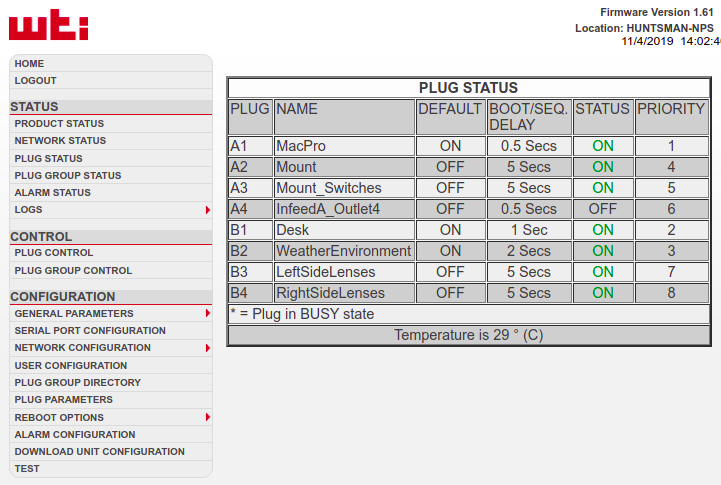

# Preparation

## Byobu session
When you are observing, you will mostly be controlling the observatory and monitoring logs through a byobu session. Generally the bybou session should already be set up. You can check which byobu sessions are currently running by using the `byobu list-sessions` command. Here is an example of the output of this command:
```
(huntsman-pocs) huntsman@huntsman-control:/home/huntsman$ byobu list-sessions
cams: 10 windows (created Mon Mar 20 17:57:26 2023)
obs: 9 windows (created Mon Mar 20 17:55:55 2023)
```
This tells us that there is a "cams" byobu session consisting of 10 windows and an "obs" session consisting of 8 windows. These are the two byobu sessions you will use to run the huntsman telescope. If they are not present you can automatically set them up using the following shell commands; `obsbyobu` for the obs session and `cambyobu` for the cams session. Once you run the command, it will generally take ~30 seconds to setup, at which point your terminal will automatically connect to the new byobu session. To switch between these sessions you can use the `alt+up` and `alt+down` shortcuts. When you run either of these commands, this is the terminal output you can expect while waiting for the setup to complete:
```
# takes about 30 seconds to run
(huntsman-pocs) huntsman@huntsman-control:/home/huntsman/$ obsbyobu
no server running on /tmp/tmux-1000/default
Creating new Observatory byobu session, session name: obs
Creating 1/9 Windows: DOCKER
Creating 2/9 Windows: POCS-CONTROL
Creating 3/9 Windows: LOGS
Creating 4/9 Windows: WDASH
Creating 5/9 Windows: NIFI-LOGS
Creating 6/9 Windows: IMAGES
Creating 7/9 Windows: UPLOAD
Creating 8/9 Windows: ARCHIVE
Creating 9/9 Windows: CONFIG

# takes about 30 seconds
(huntsman-pocs) huntsman@huntsman-control:/home/huntsman/$ cambyobu    
no server running on /tmp/tmux-1000/default
Creating new Cameras byobu session, session name: cams
Creating new window for jetson 0
Creating new window for jetson 1
Creating new window for jetson 2
Creating new window for jetson 3
Creating new window for jetson 4
Creating new window for jetson 5
Creating new window for jetson 6
Creating new window for jetson 7
Creating new window for jetson 8
Creating new window for jetson 9
```

The "cams" session contains 10 windows that each contain an ssh session for each of the 10 jetson control computers on the Huntsman Telescope. This session is useful for stopping/restarting huntsman camera servers or inspecting camera logs. 

The "obs" byobu session consists of 9 windows named; DOCKER, POCS-CONTROL, LOGS, WDASH, NIFI-LOGS, IMAGES, UPLOAD, ARCHIVE, CONFIG.

If you wish to edit the `obsbyobu` or `cambyobu` commands, you can edit their function definitions which are found in the `/home/huntsman/.zsh_functions/` directory. 

## Webcams

Open both the external and internal webcams in browser tabs. The IP addresses and account details are in the Hardware Device Info document. Do a visual check for bad weather, people in the dome or anything else potentially obstructing the movement of the mount. The internal webcam and can pan, tilt and zoom.

### Dome lights

The dome lights (wall lights and control computer monitor) can be controlled from the deCONZ (applications>Development>deCONZ) application.

## Weather

Huntsman has its own weather station (AAG CloudWatcher with anemometer) to enable it to make its own decisions about whether conditions are suitable for observing or not. We use the `panoptes/aag-weather` ([link](https://github.com/panoptes/aag-weather)) to take readings from sensor. The weather logging should be started using the `docker-compose up`, see [here](https://github.com/AstroHuntsman/huntsman-pocs/wiki/Running-Huntsman#start-huntsman-pocs-docker-services).

If for some reason you wish to start the weather logging by itself, without the other services defined in the main huntsman obs `docker-compose.yaml` file, do the following:
```
cd $PANDIR/my-aag-weather
docker-compose up
```
To check the latest weather reading:
```
http :5000/latest.json
```
You can also check out Huntsman's dash weather monitor. Once connected to the VPN, in a web browser type ```<ip address of control computer>:<port number> ``` to view it. These details are in the Huntsman hardware device info document. 

If the weather dash has not been started yet, run the following in the byobu session to start it.
```
cd /var/huntsman/huntsman-environment-monitor/src/huntsmanenv
python webapp.py
```
 
 
It is also a good idea to check other weather resources, e.g.

* [AAT Weather Data](http://aat-ops.anu.edu.au/AATdatabase/met.html)
* [2.3m/SkyMapper weather data](https://www.mso.anu.edu.au/metdata/)
* [Bureau of Meteorology](https://weather.bom.gov.au/location/r66nhfc-coonabarabran#radarMap)
* [Weatherzone](https://www.weatherzone.com.au/nsw/cw-slopes-plains/coonabarabran)

## Power

Most Huntsman systems are powered via a Network Power Switch (NPS), which allows the mains power supply to each Huntsman subsystem to be turned on or off remotely. The IP address and account details for the web interface of this NPS are in the Hardware Device Info document. When you connect to the NPS you will see the Plug Status page, similar to the following:



For observing all of the outputs should be ON, except for the currently unused A4 outlet. If any of the other outlets are turned off you need to turn them on by clicking 'Plug Control', then using the drop down menu next to the outlet to select 'On', then click 'Confirm Actions', then confirm again.

If it is necessary to power cycle part of Huntsman it can be done my selecting 'Reboot' from the Plug Control drop down menu.

## Nifi file sync with AAODC

This is a service that automatically syncs all imaging data in `/var/huntsman/images`.

Start it by running:

```
cd ~/AAO/Software/NiFi/minifi-0.5.0/
./bin/minifi.sh start
```

Also note the following useful commands:

```
cd ~/AAO/Software/NiFi/minifi-0.5.0/
grc tail -F logs/minifi-app.log
./bin/minifi.sh status
./bin/minifi.sh stop
```

## Alternative File sync using the SFTP script in `huntsman-pocs`

If nifi is not working for any reason, there is a backup file upload solution that uses sftp to sync files from the control computer to datacentral. The sftp script (`sync_data_with_remote_server.py`) can be found in the `/var/huntsman/huntsman-pocs/scripts` directory. The script has a number of parameters that are set in the the huntsman configure file found at `/var/huntsman/huntsman-config/conf_files/pocs/huntsman.yaml`, if you need to edit any of these parameters, they exist under the `remote_archiver` section in the config file.

To start the script do the following (make sure to start this script from the UPLOAD window of the observatory byobu sessino):
```
cd /var/huntsman/huntsman-pocs/scripts/
python sync_data_with_remote_server.py
```

## DomePi

Connect to the Dome Pi via SSH as user `huntsman`, i.e. `ssh huntsman@<IP address>`.

### Checking on Dome Pi

Once logged in to the Dome Pi join the byobu session by entering `byobu`. Can review logs, cancel the server, etc.

### Procedure for setting dome pi up

If you need to start the dome server it can be done using the following commands:
```
# create new bybobu session
byobu new -s domecontrol -n domeserver
# We have to run the dome server as root in order to control some of the automationhat features.
cd /home/huntsman/develop/huntsman-dome/domehunter/gRPC-server/ && sudo -E /usr/bin/python huntsman_dome_server.py -r
```
Here the `-r` tells the server to start in "real hardware" mode, you could also add a `-l` to enable debugging lights. To get help and a full description of command line options for the server use:
```
python huntsman_dome_server.py -h
```
The dome control and server loggers also log to files at the lowest log level (`debug`). These can be found in `/var/huntsman/logs/` as `domepi_*.log` and `server_log_yyyy_mm_dd.log` where the `yyyy_mm_dd` represents a date. 

The server log display can be set up by entering the follow commands:
```
cd /var/huntsman/logs/
tail -F -n 1000 server_log_yyyy_mm_dd.log
```

## TheSkyX

Connect to the main control computer via VNC. If TheSkyX is not already running click the 'X' icon to start it.

### Autoguider

Click the Autoguider button in the left column to open the Autoguider tab. If the Autoguider status is 'Not Connected' click the Connect button. The status should change to 'Ready'.

If the autoguider does not connect via TSX, you can try power cycling it using the "HubTool" application on the control computer. The device information is available on the "Hardware Device Info" google doc.

### Dome

Click the Dome button to open the Dome tab. If the Dome status is 'Not Connected' click the Connect button. The status should change to 'Ready', a value should appear next to Azimuth and a rendition of the dome aperture should appear on the main display. You should then home the dome by pressing the 'Find Home' button in the TSX Dome window. The 'Find home' routine will calibrate the domes position as well as the "degrees per tick" of the rotatory encoder used to track dome rotation. If the dome has been manually moved, the 'Find Home' routine should be run again to re calibrate the dome's position.

After 'Find Home', be sure to 'Park' dome if not using it immediately. This ensures the solar panel charging the dome shutter battery is facing the right direction.

### Mount

Click the Telescope button to open the telescope mount tab. If the mount status is 'Not Connected' click the 'Start Up' button to bring up the drop down menu and click Connect Telescope. The status should be 'Parked'. If the status is something else park the mount for now by clicking the 'Shut Down' button to bring up the drop down menu and click Park.

## Dome Shutter

The Huntsman dome shutter is controlled by a microcontroller attached to the dome called Musca (a 'fly on the wall'). In normal operation this should be controlled by POCS (not yet, at the time of writing), but there is also a Tcl/Tk GUI app which can be used to manually open or close the shutter or check on the status of the dome battery and its solar charger. 

First connect control computer to the Musca/TinyOS bluetooth device. This should be done automatically upon boot, if the shutter is not connected you can try and restart the services using (see `huntsman_import_docs/subsystems/dome/Bluetooth_setup`):
```
systemctl start HuntsmanShutterConnection.service
```
Sometimes the service will attempt to connect to the shutter and fail, to determine if this has occurred after a reboot you can check the status of the service:
```
systemctl status HuntsmanShutterConnection.service
```
Otherwise you can connect using the following command.
```
sudo rfcomm connect rfcomm0 20:13:11:05:17:32
```
Use `huntsman-pocs` to control the shutter:
```
from huntsman.pocs.dome import create_dome_from_config

dome = create_dome_from_config()
dome.status  # get info about battery voltage and shutter status

dome.open()
dome.close()
```


Alternatively, use the Musca GUI by connecting to the control computer via VNC. To start the GUI:
```
cd /var/huntsman
wish Musca_huntsman.tcl &
```
**Note that Musca contains a watchdog timer that will automatically close the dome shutter after 10 minutes if no 'Keep_dome_open' message is received. It is not possible to send these messages with the current version of the GUI.**

# Starting huntsman-pocs

These are the main instructions for running Huntsman when everything is already up, including:
 - TSX
 - telescope mount
 - connect TSX to the dome, mount, autoguider
 - if the Dome was manually parked, then you might need to Slew to 300 to home it.

If nothing is up, you must go to the top of this page and start various things like mounts, etc.

## Open weather info for SSO

See this [section](https://github.com/AstroHuntsman/huntsman-pocs/wiki/Running-Huntsman#weather).

## Log onto the control computer

If the control computer is power cycled via `sudo reboot` you will need to also do a hard power cycle the control computer from the NPS. Turn it off for 30 seconds and then on again. 

SSH into the main control computer and start or join a `byobu` session. Should be named `Huntsman` (list all by `byobu list-sessions`). 

If no byobu is running, it can be started by navigating to `/var/huntsman/huntsman-pocs/scripts` and then run `python byobu_startup.py` to start the byobu. 

There are 4 windows:

 - docker configure server 
 - ipython (where you run POCS)
 - weather
 - logs

## Update config files

We have a private repo where config files are stored. You can get the latest version with this command:
```
cd ${PANDIR}/huntsman-config && git pull
```

## Camera Services

The camera servers run on the Raspberry Pis and are responsible for exposing the cameras over the network. They are (re)started automatically on rebooting the pis. To restart a single pi, `ssh` into that pi and do `sudo reboot`. To restart all the pis, use the NPS. 

Note that the most recent version of `huntsman-pocs` will be pulled onto the pi following reboot.

A full reboot via the NPS will take about 2 minutes. Don't run POCS until these are back up. To check the camera services are running, SSH onto the pi and join the `byobu` session.

## Start huntsman-pocs docker services

In the Docker byobu window, start up the `huntsman-pocs` docker services:
```
cd ${PANDIR}/huntsman-config/conf_files/pocs
git pull
docker-compose down
docker system prune -f
docker volume prune -f
docker-compose pull
docker-compose up
```

## POCS logs

The main POCS logs are displayed in the right pane of the `POCS` `byobu` window. If they are not already being display then start the log viewing by selecting the pane and entering:
```
cd $PANLOG && tail -F -n 1000 panoptes.log
```

To access the individual camera logs, you must log in and go into the `byobu` of the pi hosting a camera.

## Run POCS

`huntsman-pocs` should always be run from an `ipython` session inside the docker container named `pocs-control`. To start the docker container, do:
```
docker exec -it pocs-control /bin/bash
```
Then start an `ipython` session in the right `byobu` session. From there, do:
```
from huntsman.pocs.utils.huntsman import create_huntsman_pocs

pocs = create_huntsman_pocs(with_dome=True, simulators=["power"])
pocs.run()
```

If there is an error (e.g. connecting to dome), it is OK to kill the `run()` and restart the `ipython` session until it works.

### How to shutdown

Not needed because POCS will automatically shut down.

But the dome currently doesn't park, so you need to Park it in TSX manually by Slewing to 300 degrees.

### Modify POCS time so you can simulate night time during the day
```
import os
from panoptes.pocs.mount import create_mount_simulator
from huntsman.pocs.utils.huntsman import create_huntsman_pocs

os.environ["POCSTIME"] = "2020-10-09 08:30:00"  # You may get `FileExistsError`s if the date has already been used

mount = create_mount_simulator()  # Use a mount simulator to prevent mount slewing issues

# Make POCS instance without dome for Sun/weather safety
pocs = create_huntsman_pocs(mount=mount, simulators=["power", "weather"], with_dome=False, with_autoguider=False)

pocs.run()
```

#### If you need to close the dome manually

If you need to close the dome, just run the following commands:

```
pocs.observatory.close_dome()
```

#### Park Huntsman
```
pocs.park()
```
When running POCS should automatically park at the end of the night, or if the weather becomes unsuitable. If you have stopped POCS and need to manually park Huntsman however this is the command to do it. 

At the moment this only parks the mount, it does not close the dome shutter or rotate the dome to the park position. To close the dome shutter use the Musca GUI, and to park the dome at the correct position use the Dome tab in TheSkyX. After the mount has finished parking click 'GotoAz' and enter 300 degrees. Once the dome has rotated into position click 'Park' to ensure it stays put.

#### Power down mount etc. Not really.
```
pocs.power_down()
```
This command will park the mount (and, once implemented, the dome) then disconnect from TheSkyX.

#### Clean up

To close connections to all hardware and start afresh first park (or power down) and then exit the IPython session with `Ctrl-d`. It is not normally necessary to shut down either the Camera Servers or the Name Server. These can be left running unless there is a need to update the software, or a problem with a camera.

# Troubleshooting

## When cameras fail

Start over from the [top](https://github.com/AstroHuntsman/huntsman-pocs/wiki/Running-Huntsman#starting-huntsman-pocs).

## Setting observing time to test different POCS states

From command line can set to just before evening twilight calibration sequence (time UTC):
```
export POCS_TIME="2019-12-13 09:30:00"
```

*Remember* to unset this environment variable when finished:
```
unset POCS_TIME
```

Can also set/unset from e.g. jupyter notebook or ipython:
```
import os
os.environ['POCSTIME'] = "2019-12-13 09:30:00"

#and unset
del os.environ['POCSTIME']
```

## Old IERS A file

When running POCs, you may encounter a warning that looks like: 
```
Interpolating from IERS_auto using predictive values that are more than 30 days old
```
This is problematic as it means Huntsman does not know what time it is and can therefore behave unexpectedly. To fix this, ensure that the latest version of astropy is installed. You can then try and manually download the IERS files:
```
from astropy.utils.data import download_file
from astropy.utils.iers import IERS_A_URL
download_file(IERS_A_URL, cache=True)
```
If that doesn't work (e.g. because of a HTTPError), then you can try and download from a mirror instead:
```
from astropy.utils.iers import IERS_A_URL_MIRROR
download_file(IERS_A_URL_MIRROR, cache=True)
```
You may find additional information [here](https://github.com/astropy/astropy/issues/9499).

## Reboot into BIOS
If, for whatever reason, you need to boot into BIOS on the control computer you can use the following command,
```
sudo systemctl reboot --firmware-setup
```
The normal method of pressing a specific key during start up does not appear to work for the control computer.

## Wake On Lan for control computer
If the control computer is powered down it can be powered on by sending a "magic packet" from another device on the network. This can be done using a python module called `wakeonlan` (installed on domepi) and the control computers MAC address.
To power on the control computer using WOL, ssh into the domepi and run the following,
```
python
from wakeonlan import send_magic_packet

send_magic_packet("<insert control comp MAC address here>")
```

## Dome Home position not triggering
Occasionally the dome controller will stop detecting when the dome passes the home position. This seems to occur when moving the dome for the first time after a couple of days of inactivity. Manually (or through TheSkyX GUI) sending the dome back and forth over the home position (using webcam for reference) appears to "fix" the problem. Restarting the dome control server running on the domepi also appears to help.

## Capturing focus plots 

Below is some code to download all the focus plots 
```
# huntsman observing shortcuts
alias get_cfocus='ssh huntsman@192.168.80.100 "tar cf - /var/huntsman/images/focus/*/$(date -u +"%Y%m%d")T*/coarse-focus*.png"|tar xf - && cp -r ./var/huntsman/images/focus/*/ ./ && rm -r ./var'
alias get_ffocus='ssh huntsman@192.168.80.100 "tar cf - /var/huntsman/images/focus/*/$(date -u +"%Y%m%d")T*/fine-focus*.png"|tar xf - && cp -r ./var/huntsman/images/focus/*/ ./ && rm -r ./var'
```