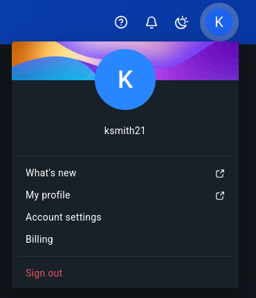
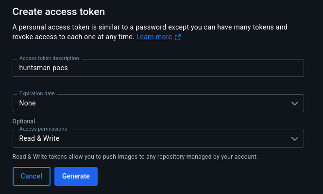

# Using Docker

Huntsman utilises Docker containerisation as well as the official remote Docker registry, [Docker Hub](https://hub.docker.com).

## First Time Setup

### Docker Hub setup and Personal Access Token

If you have not already done so, set up a new free account on Docker Hub. The username you choose will be important for accessing your images.

Next, up a Peronal Access Token (PAT). To do so, access your account settings from the Docker Hub website:



On the left-hand side ribbon, in the **settings** dropdown, select **Personal access tokens**. Then select the **Generate new token** box, which will prompt you to fill in a few boxes:



Choose a descriptive name for the token and set the **Access permissions** to at least be able to _Read & Write_. You may also set an expiration date for added security if you'd like.

After selecting **Generate Token**, you will be shown the token and how to use it. Save the token somewhere safe as it will not be displayed again. If you lose the token, delete the PAT and make a new one.

For Hunstamn's purposes, the PAT is used to push images to your remote registry. Make sure it's set as the `DOCKER_PAT` [environment variable](Environment-and-Configuration.md). While adding this, also add your Docker username as the `DOCKER_USER` variable.

### Image Build

For a first-time setup, there are four main images that need to be built. In order these are:

- Panoptes Utils
- Panoptes POCS
- Huntsman POCS
- Huntsman Camera

After setting up the `DOCKER_USER` and `DOCKER_PAT` environment variables (see above section), we need to also set the `DOCKER_TAG` variable, which will determine the tag that will be associated with the newly generated images upon building them.

A tag is a form of image versioning and differentates different images of the same origin but with different variants. A tag can be any string, for our purposes, it's simplest to use the Git branch we're working in to tag the image. So if we're building the image from the "main" branch for example, we'd set the `DOCKER_TAG` to `main`.

> Note: The Panoptes image tags are unaffected by the `DOCKER_TAG` variable as they are static and their contents shouldn't change. For this reason, they generally will only need to be built once.

Image creation can be streamlined with the `scripts/setup_docker_images.sh` script. Ensure that the `huntsman.env` file is sourced, then run the script. For a list of options, run it with the `-h` tag.

General usage is as follows:

```bash
# Build and push all images to docker registry
$HUNTSMAN_POCS/scripts/build_push_images.sh

# Optionally, don't push the images to Docker Hub. By default, images will be pushed to the DOCKER_USER's repository
$HUNTSMAN_POCS/scripts/build_push_images.sh --no-push

# If you've already build the panoptes images and don't want to have to rebuild (their tags are static)
$HUNTSMAN_POCS/scripts/build_push_images.sh --no-pan-utils --no-pan-pocs
```

## How Is Docker Used?

Once the two Huntsman images are built and pushed to the registry, they are available globally - as in from anywhere in the globe.

This makes is trivial to run the Huntsman software - provided whatever you want to run it on has a Docker runtime environment.

Since the docker images were likely built on the Control server (although this isn't strictly necessary), it needn't pull them as they're available locally.

However, the Camera and Remote servers will automatically pull them from Docker Hub when invoked (for example, with `docker run huntsmanarry/huntsman-pocs:latest`).
